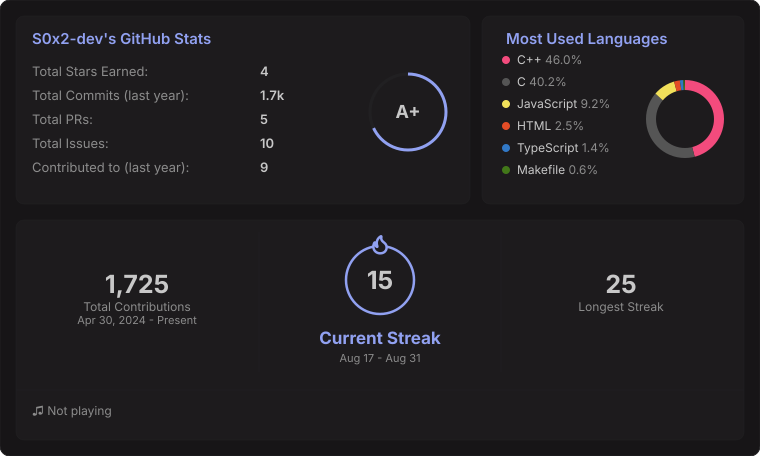

<table>
<tr>
<td style="border: 2px solid #212022; padding: 16px; background-color: #171517;">
<picture>
  <source media="(prefers-color-scheme: dark)" srcset="https://raw.githubusercontent.com/Slaughterhouse-dev/Slaughterhouse-dev/output/github-snake-dark.svg" />
  <source media="(prefers-color-scheme: light)" srcset="https://raw.githubusercontent.com/Slaughterhouse-dev/Slaughterhouse-dev/output/github-snake.svg" />
  
</picture>

  

</td>
</tr>
</table>

